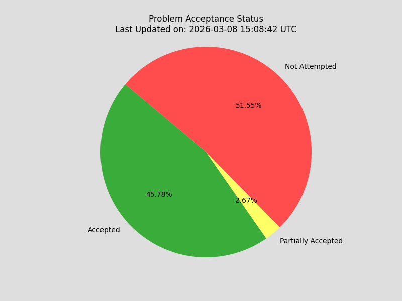
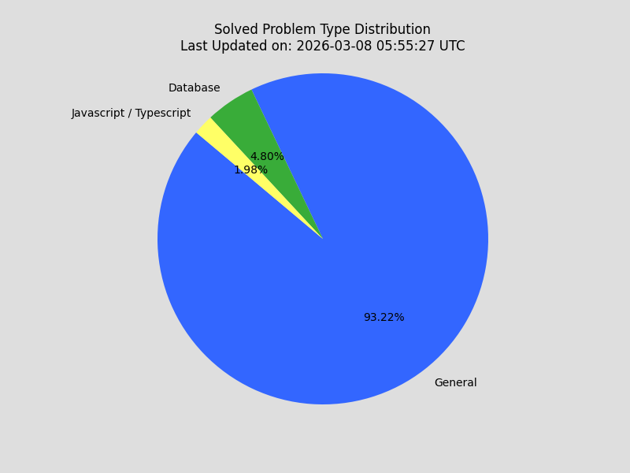
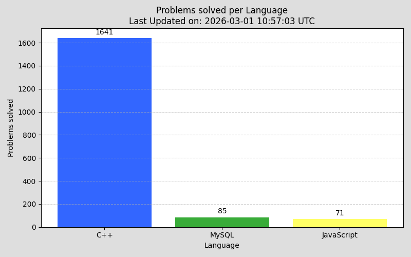
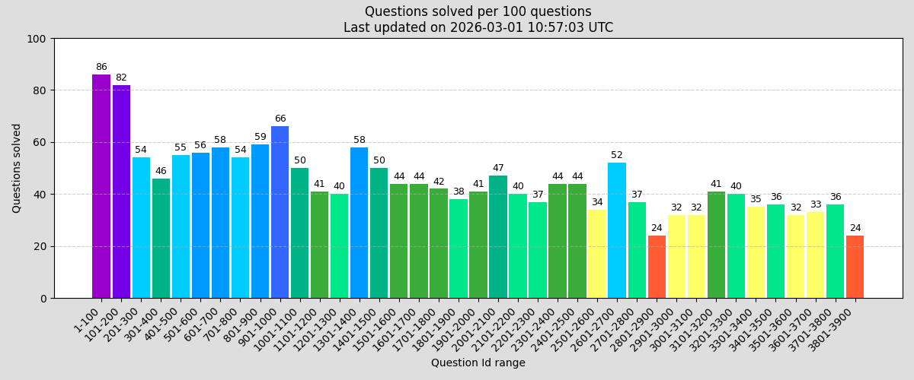

# Summary

This repo contains solutions to over **1700** problems from [leetcode.com](https://leetcode.com/problemset/ "leetcode") (in 3 languages):

-   C++
-   Javascript
-   MySQL

---

## Some points to be noted

-   A problem can have multiple solutions, marked with [1], [2], [3], ... at the end. Generally, higher number indicates more efficient or less intuitive solution.
-   Partially accepted solutions are marked with **[TLE]** or **[MLE]** in their title, representing 'Time Limit Exceeded' and 'Memory Limit Exceeded' respectively.
-   Most solutions have Time and Space Complexity mentioned as **T.C.=O()** and **S.C.=O()** respectively.
-   A list of all algorithms can be found in '[this csv file](./algorithms/metadata/algorithms_metadata.csv)'.
-   There are some problems with solutions in multiple languages (C++ and Javascript).
-   The C++ directory is split into 8 parts (with a range of 500 each): [0001-0500], [0501-1000], ..., [3501-4000]. This is done to overcome the limitation of github webview only allowing a max of 1000 files to be displayed in a directory.

---

## Stats

<!-- UPDATE STATS HERE -->
Last updated on _Sat, 14 Feb 2026 05:18:17 GMT_
### Total problems solved:
| Accepted | Partially accepted | Link |
| --- | --- | --- |
| 1753 | 103 | [csv](./stats/generated/leetcode-stats.csv)|
### Total problems solved per language:
| Language  | Accepted | Partially accepted | Links Table |
| --- | --- | --- | --- |
| C++ | 1630 | 103 | [click](./stats/generated/link-tables/leetcode-links-cpp.md)
| Javascript | 71 | 0 | [click](./stats/generated/link-tables/leetcode-links-js.md)
| MySQL | 85 | 0 | [click](./stats/generated/link-tables/leetcode-links-mysql.md)
<!-- UPDATE STATS HERE -->

use ctrl + click to open the links in a new tab for the best experience.

---

---
