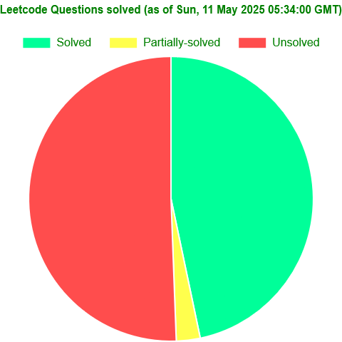
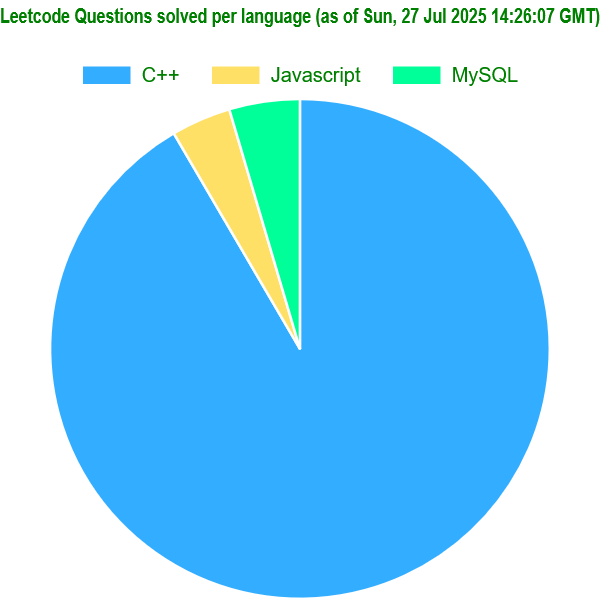
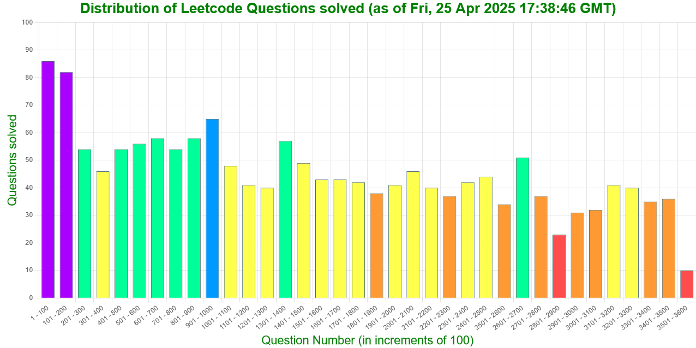

# Summary
This repo contains solutions to over 1700 problems from [leetcode.com](https://leetcode.com/problemset/ "leetcode") (in 3 languages):
* C++ (over **1600** solutions)
* Javascript (over **65** solutions)
* MySQL (over **75** solutions)

---

## Some points to be noted
* A problem can have multiple solutions, marked with [1], [2], [3], ... at the end. Generally, higher number indicates more efficient or less intuitive solution.
* Partially accepted solutions are marked with **[TLE]** or **[MLE]** in their title, representing 'Time Limit Exceeded' and 'Memory Limit Exceeded' respectively.
* Most solutions have Time and Space Complexity mentioned as **T.C.=O()** and **S.C.=O()** respectively.
* A list of all the Leetcode solutions present in this repo can be found in '[this csv file](./stats/generated/leetcode-stats.csv)'.
* A list of all algorithms can be found in '[this csv file](./algorithms/metadata/algorithms_metadata.csv)'.
* There are some problems with solutions in multiple languages (C++ and Javascript).
* The C++ directory is split into 8 parts (with a range of 500 each): [0001-0500], [0501-1000], ..., [3501-4000]. This is done to overcome the limitation of github webview only allowing a max of 1000 files to be displayed in a directory.
---

<!-- STATS -->
## Stats
Last updated on _Wed, 26 Nov 2025 16:48:43 GMT_
### Total problems solved:
| Accepted | Partially accepted |
| --- | --- |
| 1717 | 100 |
### Total problems solved per language:
| Language  | Accepted | Partially accepted |
| --- | --- | --- |
| C++ | 1601 | 100 |
| Javascript | 66 | 0 |
| MySQL | 78 | 0 |
<!-- STATS -->
---

---
