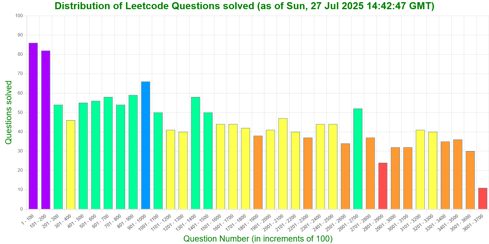

# Summary
This repo contains solutions to over 1600 problems from [leetcode.com](https://leetcode.com/problemset/ "leetcode") (in 3 languages):
* C++ (over **1550** solutions)
* Javascript (over **65** solutions)
* MySQL (over **75** solutions)

---

## Some points to be noted
* A problem can have multiple solutions, marked with [1], [2], [3], ... at the end. Generally, higher number indicates more efficient or less intuitive solution.
* Partially accepted solutions are marked with **[TLE]** or **[MLE]** in their title, representing "Time Limit Exceeded" and "Memory Limit Exceeded" respectively.
* Most solutions have Time and Space Complexity mentioned as **T.C.=O()** and **S.C.=O()** respectively.
* The C++ directory is split into 8 parts (with a range of 500 each): [1-500], [501-1000], ..., [3501-4000]. This is done to overcome the limitation of github webview only allowing a max of 1000 files to be displayed in a directory.
* There are some problems with solutions in multiple languages (C++ and Javascript).
* A list of all the Leetcode solutions present in this repo can be found in the file at location './stats/generated/solution_stats [*ISO date-time of generation*].csv'
* A list of all algorithms can be found in the file at location './algorithms/metadata/algorithms_metadata.csv'
---

---

---

---